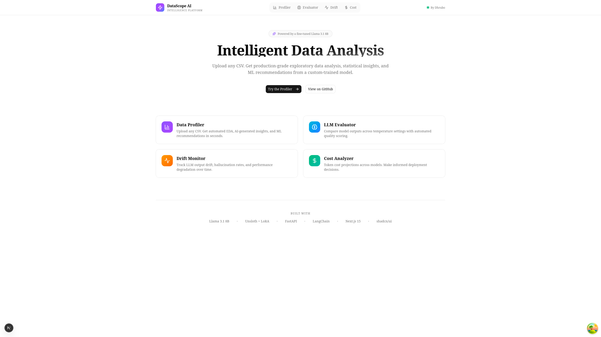
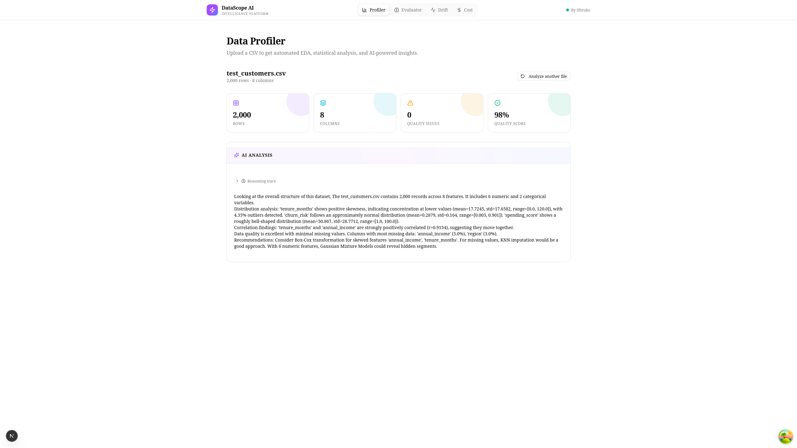
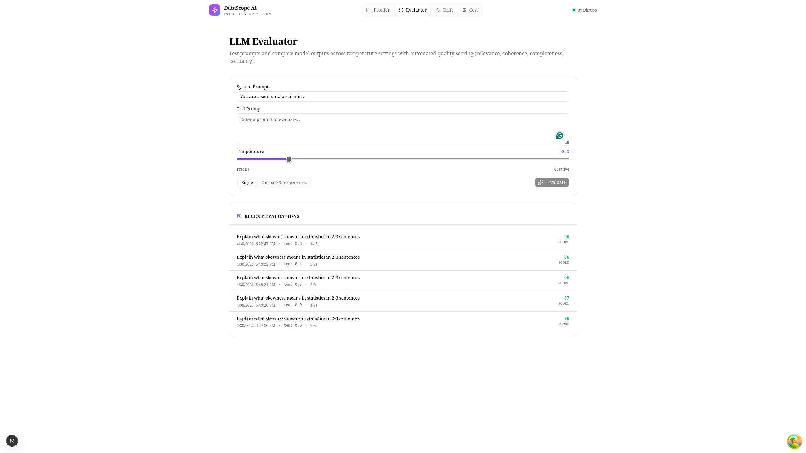
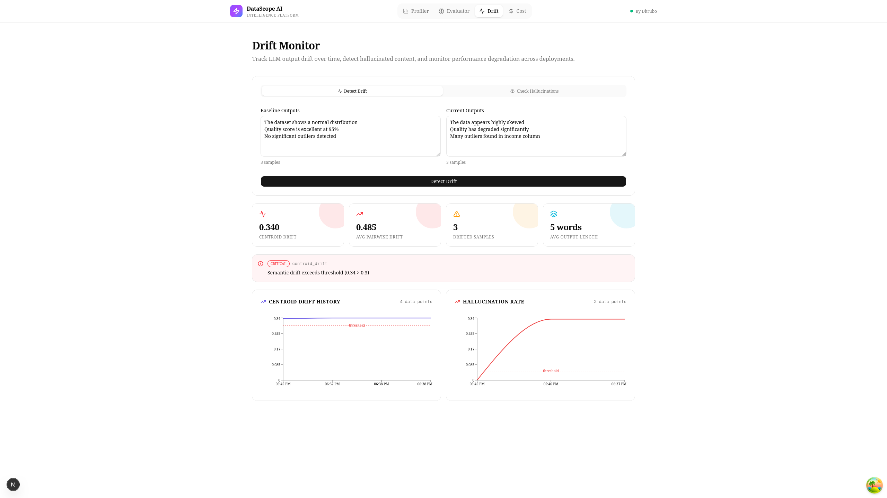
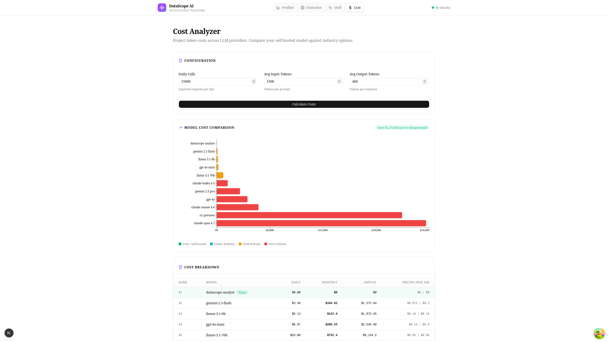

# DataScope AI

> Full-stack LLM operations platform built on a custom fine-tuned model. Profile any CSV, evaluate model outputs, monitor drift, and analyze costs — all powered by your own LLM, not hosted APIs.


---

## Preview



| Profiler | Evaluator |
|----------|-----------|
|  |  |

| Drift Monitor | Cost Analyzer |
|---------------|---------------|
|  |  |

## What is DataScope AI?

A complete LLM operations dashboard built end-to-end without relying on hosted APIs. The system combines a fine-tuned Llama 3.1 8B model with statistical analysis services to deliver four production-grade tools:

1. **Data Profiler** — Upload any CSV, get automated EDA + AI-generated insights
2. **LLM Evaluator** — Test prompts across temperatures with automated quality scoring (LLM-as-judge)
3. **Drift Monitor** — Semantic drift detection, hallucination flagging, time-series tracking
4. **Cost Analyzer** — Token cost projections across 11 LLM providers

## Architecture

```
┌─────────────────┐     ┌────────────────────┐     ┌─────────────────────┐
│  Next.js 15     │────▶│  FastAPI           │────▶│  Fine-Tuned LLM     │
│  + shadcn/ui    │◀────│  + LangChain       │◀────│  Llama 3.1 8B + LoRA│
│  + TanStack     │ JSON│  + Pandas/SciPy    │     │  via Ollama         │
│  + Recharts     │     │  + sentence-trans  │     └─────────────────────┘
└─────────────────┘     │  + SQLite metrics  │     ┌─────────────────────┐
                        └────────────────────┘────▶│  Embedding Engine   │
                                                   │  all-MiniLM-L6-v2   │
                                                   └─────────────────────┘
     Frontend                Backend                    ML Layer
```

**Three layers, clean separation:**
- **Frontend** — UI dashboard with TanStack Query state management
- **Backend** — FastAPI server with engines (LLM, embeddings, metrics) and services (profiler, evaluator, drift, cost)
- **ML** — Training pipeline (Unsloth + LoRA) and runtime services

## Tech Stack

| Layer | Technology |
|-------|-----------|
| Base Model | Llama 3.1 8B Instruct (4-bit quantized) |
| Fine-Tuning | Unsloth + LoRA (r=16, alpha=32) |
| Inference | Ollama (GGUF Q4_K_M) |
| Embeddings | sentence-transformers (all-MiniLM-L6-v2) |
| Backend | FastAPI, Pydantic, LangChain, Pandas, SciPy, aiosqlite |
| Frontend | Next.js 15, TypeScript, Tailwind CSS v4, shadcn/ui |
| State Management | TanStack Query |
| Charts | Recharts |
| Markdown | react-markdown + remark-gfm |

## Features

### 1. Data Profiler
Upload any CSV and receive:
- Automated statistical profiling (mean, std, skewness, kurtosis, IQR outliers)
- Correlation analysis with strength classification
- Data quality scoring with column-level callouts
- AI-generated insights with actionable ML recommendations
- Reasoning trace (chain-of-thought visibility)

### 2. LLM Evaluator
- Single-prompt evaluation with quality scoring
- Multi-temperature comparison (parallel async inference)
- LLM-as-judge scoring across 4 dimensions (relevance, coherence, completeness, factuality)
- Latency and token tracking
- Persistent evaluation history (SQLite)

### 3. Drift Monitor
- Semantic drift detection via sentence embeddings
- Statistical drift on input distributions
- Hallucination detection (flags numbers/entities not in source context)
- Real-time alerts (critical/warning/info)
- Time-series charts with threshold reference lines
- Auto-refreshing history

### 4. Cost Analyzer
- Token cost calculations across 11 LLM providers
- Daily/monthly/annual projections
- Cost comparison bar chart with color-coded tiers
- Detailed pricing table with rankings
- Self-hosted vs paid savings calculator

## Project Structure

```
datascope-ai/
├── ml/                          # ML training pipeline
│   ├── configs/
│   │   ├── model_config.yaml    # Base model + LoRA settings
│   │   └── training_config.yaml # Hyperparameters
│   ├── scripts/
│   │   ├── generate_training_data.py  # 14-domain synthetic generator
│   │   ├── train.py             # Unsloth fine-tuning
│   │   └── export.py            # Model export utility
│   └── data/processed/
│       └── datascope_train.toon # 10K training examples
│
├── backend/                     # FastAPI server
│   ├── app/
│   │   ├── api/                 # Route handlers
│   │   │   ├── profiler.py
│   │   │   ├── evaluator.py
│   │   │   ├── drift.py
│   │   │   └── cost.py
│   │   ├── engines/             # ML services (heavy)
│   │   │   ├── llm_engine.py
│   │   │   ├── embedding_engine.py
│   │   │   └── metrics_store.py
│   │   ├── services/            # Business logic
│   │   │   ├── profiler_service.py
│   │   │   ├── insight_service.py
│   │   │   ├── evaluator_service.py
│   │   │   ├── drift_service.py
│   │   │   └── cost_service.py
│   │   ├── models/              # Pydantic schemas
│   │   ├── config.py
│   │   └── main.py
│   └── requirements.txt
│
├── frontend/                    # Next.js dashboard
│   ├── src/
│   │   ├── app/                 # App Router pages
│   │   ├── components/
│   │   ├── hooks/               # TanStack Query hooks
│   │   ├── lib/                 # API client, constants
│   │   └── types/               # TypeScript interfaces
│   └── package.json
│
└── screenshots/                 # README assets
```

## Setup

### Prerequisites
- Python 3.12+
- Node.js 20+
- pnpm 9+
- NVIDIA GPU with 16GB+ VRAM (for training only)
- Ollama

### 1. Clone

```bash
git clone https://github.com/Exile404/Datascope-AI.git
cd Datascope-AI
```

### 2. ML Pipeline (skip if just running)

```bash
cd ml
python3 -m venv ml-env
source ml-env/bin/activate
pip install -r requirements.txt
pip install -r requirements-train.txt

cd scripts
python generate_training_data.py --num_examples 10000
python train.py
```

### 3. Backend

```bash
cd backend
python3 -m venv backend-env
source backend-env/bin/activate
pip install -r requirements.txt
cp .env.example .env

uvicorn app.main:app --reload --port 8000
```

API docs: http://localhost:8000/docs

### 4. Frontend

```bash
cd frontend
pnpm install
echo "NEXT_PUBLIC_API_URL=http://localhost:8000" > .env.local
pnpm dev
```

App: http://localhost:3000

### 5. Ollama

```bash
curl -fsSL https://ollama.com/install.sh | sh
cd ml/scripts/models/datascope-analyst-gguf_gguf
ollama create datascope-analyst -f ./Modelfile
```

## API Endpoints

### Profiler
| Method | Endpoint | Description |
|--------|----------|-------------|
| POST | `/api/profiler/profile` | CSV → statistics only |
| POST | `/api/profiler/insight` | CSV → full LLM analysis |

### Evaluator
| Method | Endpoint | Description |
|--------|----------|-------------|
| POST | `/api/evaluator/evaluate` | Single eval with quality scoring |
| POST | `/api/evaluator/compare` | Multi-temperature comparison |
| GET | `/api/evaluator/history` | Recent evaluations |

### Drift
| Method | Endpoint | Description |
|--------|----------|-------------|
| POST | `/api/drift/detect` | Semantic + statistical drift |
| POST | `/api/drift/hallucinations` | Invented content detection |
| GET | `/api/drift/history/{metric}` | Time-series for any metric |

### Cost
| Method | Endpoint | Description |
|--------|----------|-------------|
| POST | `/api/cost/calculate` | Single call cost |
| POST | `/api/cost/project` | Multi-model projections |
| GET | `/api/cost/usage` | Real usage from metrics store |
| GET | `/api/cost/models` | All supported models |

## Training Details

### Dataset
- **10,000 synthetic examples** across **14 domains**: E-Commerce, Healthcare, Finance, HR, IoT, Education, Marketing, Real Estate, Logistics, Social Media, Cybersecurity, Retail, Weather, Sports
- **Format**: Custom `.toon` format with `[system]/[input]/[output]` blocks
- **Augmentation**: Multiple distributions (normal, log-normal, beta, exponential, t-distribution, bimodal), realistic correlations, missing value injection

### Hyperparameters
```yaml
base_model: unsloth/Meta-Llama-3.1-8B-Instruct-bnb-4bit
lora:
  r: 16
  alpha: 32
  target_modules: [q_proj, k_proj, v_proj, o_proj, gate_proj, up_proj, down_proj]
training:
  epochs: 3
  effective_batch_size: 16
  learning_rate: 2e-4
  scheduler: cosine
  warmup_ratio: 0.05
  precision: bf16
```

### Results
- Final training loss: **0.4815**
- Trained in ~7 hours on RTX 5060 Ti (16GB)
- Average quality score (LLM-as-judge): **96/100**

## Roadmap (v3)

- [ ] Multi-agent orchestration (Statistician + Correlation + Quality + Strategist agents)
- [ ] Streaming token output in UI
- [ ] Histogram + correlation heatmap visualizations
- [ ] Authentication + multi-tenancy
- [ ] Docker Compose for one-command deployment
- [ ] Vercel + Railway deployment guides
- [ ] CI/CD with GitHub Actions

## Author

**Tahsinul Haque Dhrubo**
Master of Data Science — Deakin University
[GitHub: @Exile404](https://github.com/Exile404)

## License

MIT

## AI Usage
Used AI to create readme.md and debugging the code